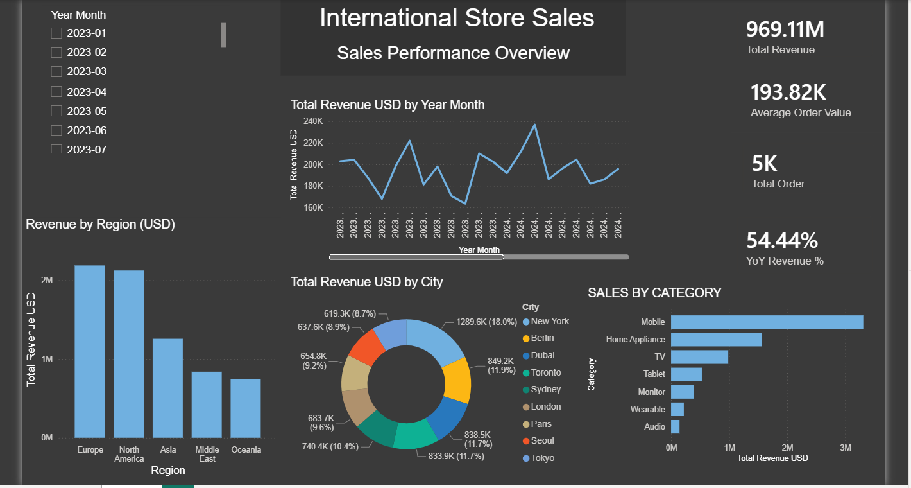

# 📊 Samsung Global Sales Intelligence

### Global Sales Analytics Dashboard | Power BI

> An interactive business intelligence solution designed to analyze Samsung's global sales performance, revenue trends, product performance, regional contribution, and year-over-year growth.

---

## 🖼️ Dashboard Preview



---

## 🎯 Project Overview

**Samsung Global Sales Intelligence** is an end-to-end Power BI analytics project focused on transforming raw global sales data into actionable business insights.

The project combines **Excel data preparation, Power Query, Data Modeling, DAX, and interactive Power BI visualizations** to create a management-oriented sales dashboard.

The main objective is to provide a clear view of:

* Global revenue performance
* Sales trends over time
* Product and category performance
* Regional sales contribution
* Year-over-Year growth
* Month-over-Month changes
* Customer and order metrics
* Key business performance indicators

---

## 💼 Business Questions

This dashboard was designed to answer questions such as:

* How is overall revenue performing?
* Which regions generate the highest revenue?
* How does sales performance change over time?
* Which product categories contribute the most to revenue?
* How has revenue changed compared with the previous year?
* What is the month-over-month growth?
* What are the key KPIs management should monitor?

---

## 📌 Key Performance Indicators

The dashboard includes several business KPIs, including:

| KPI                    | Description                                    |
| ---------------------- | ---------------------------------------------- |
| 💰 Total Revenue       | Overall generated sales revenue                |
| 🧾 Total Orders        | Number of sales orders                         |
| 📦 Average Order Value | Average revenue generated per order            |
| 📈 YoY Growth          | Revenue growth compared with the previous year |
| 📊 MoM Growth          | Month-over-month revenue change                |
| 🌎 Regional Revenue    | Revenue contribution by region                 |

---

## 📈 Dashboard Components

### Monthly Sales Trend

Tracks revenue performance over time and helps identify:

* Growth patterns
* Seasonal behavior
* Periods of high and low performance
* Changes in sales momentum

### Sales by Category

Provides a breakdown of revenue across product categories and makes it easier to identify major contributors to overall sales.

### Revenue by Region

Shows the geographic distribution of revenue and allows comparison between different markets.

### KPI Cards

The dashboard provides a high-level executive view through KPI cards for the most important business metrics.

---

## 🧠 Data Model

The project uses a **Star Schema** approach to create a scalable and analytical data model.

```text
                    ┌───────────────┐
                    │  DimCustomer  │
                    └───────┬───────┘
                            │
                            │
┌──────────────┐      ┌─────▼─────┐      ┌──────────────┐
│  DimProduct  │──────│  FactSales │──────│  DimLocation │
└──────────────┘      └─────▲─────┘      └──────────────┘
                            │
                            │
                    ┌───────┴───────┐
                    │    DimDate    │
                    └───────────────┘
```

### Fact Table

**FactSales**

Contains transactional sales information such as:

* Order ID
* Order Date
* Customer ID
* Product ID
* Location
* Revenue
* Sales-related metrics

### Dimension Tables

**DimProduct**

Contains product and category information.

**DimCustomer**

Contains customer-related attributes.

**DimLocation**

Contains geographic information.

**DimDate**

Provides the time dimension required for time-intelligence calculations.

The Date dimension includes fields such as:

* Year
* Month
* Month Number
* Quarter
* YearMonth
* YearMonth Number

---

## 🧮 DAX & Analytics

DAX was used to create business measures and time-based calculations.

Examples include:

* Total Revenue
* Total Orders
* Average Revenue
* Month-over-Month Growth
* Year-over-Year Growth
* Revenue by Region
* Revenue by Category

Example:

```DAX
Total Revenue =
SUM(FactSales[Revenue])
```

Year-over-Year analysis was implemented using Power BI time-intelligence functionality to compare current-period revenue with the corresponding previous-year period.

---

## 🔄 Data Preparation

The data preparation workflow was implemented using **Power Query**.

Main steps included:

1. Importing the Excel dataset
2. Cleaning and transforming raw data
3. Correcting data types
4. Creating relationships between tables
5. Building the Date dimension
6. Preparing currency-related data
7. Creating calculated columns where required
8. Loading the final model into Power BI

---

## 💱 Currency Analysis

The project also incorporates exchange-rate data to support analysis across different currencies.

The exchange-rate data was integrated into the Power BI data model using **Power Query** and relationships between relevant tables.

This allows the dashboard to support more flexible financial analysis across international markets.

---

## 🛠️ Tools & Technologies

| Tool               | Purpose                        |
| ------------------ | ------------------------------ |
| 🟨 Microsoft Excel | Source dataset                 |
| 🟨 Power BI        | Data visualization & dashboard |
| 🟦 Power Query     | Data cleaning & transformation |
| 🟪 DAX             | Business calculations & KPIs   |
| 🟩 Data Modeling   | Star schema & relationships    |
| 🟧 GitHub          | Version control & portfolio    |

---

## 📂 Project Structure

```text
Samsung_Global_Sales_Intelligence/
│
├── README.md
│
├── PowerBI/
│   └── Samsung_Global_Sales_Intelligence.pbix
│
├── Dashboard/
│   └── Sales-Dashboard.png
│
└── Data/
    └── Samsung_Global_Sales.xlsx
```

---

## 🚀 How to Use

### 1. Clone the repository

```bash
git clone https://github.com/arshiasadri/Samsung_Global_Sales_Intelligence.git
```

### 2. Open the Power BI project

Navigate to:

```text
PowerBI/
```

and open:

```text
Samsung_Global_Sales_Intelligence.pbix
```

### 3. Explore the dashboard

Use the interactive visuals, filters, KPIs, and time-based analysis to explore the sales performance.

---

## 🔍 Key Insights

The dashboard can be used to identify:

* High-performing regions
* Revenue concentration across product categories
* Monthly sales trends
* Year-over-Year performance
* Changes in sales momentum
* Major contributors to total revenue

These insights can support business decisions related to **sales performance, regional strategy, product focus, and revenue monitoring**.

---

## 🎓 Skills Demonstrated

This project demonstrates practical experience with:

* Data Cleaning
* Data Transformation
* Data Modeling
* Star Schema Design
* Power Query
* DAX
* Time Intelligence
* KPI Development
* Business Intelligence
* Data Visualization
* Dashboard Design
* Analytical Storytelling
* Git & GitHub

---

## 📸 Project Preview

The complete interactive Power BI dashboard is available in the repository:

📁 `PowerBI/Samsung_Global_Sales_Intelligence.pbix`

Dashboard preview:

📁 `Dashboard/Sales-Dashboard.png`

---

## 👨‍💻 Author

### Arshia Sadri

Computer Science Student | Data Analyst & Python Developer

Interested in:

* Data Analytics
* Business Intelligence
* Machine Learning
* Python Development
* Data Visualization

### 🔗 GitHub

[github.com/arshiasadri](https://github.com/arshiasadri)

---

## ⭐ Project

If you find this project useful or interesting, feel free to explore the repository and review the Power BI implementation.

**Built with Power BI • Power Query • DAX • Excel • Data Modeling**

